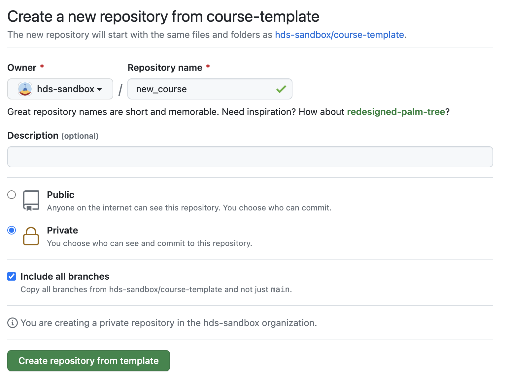
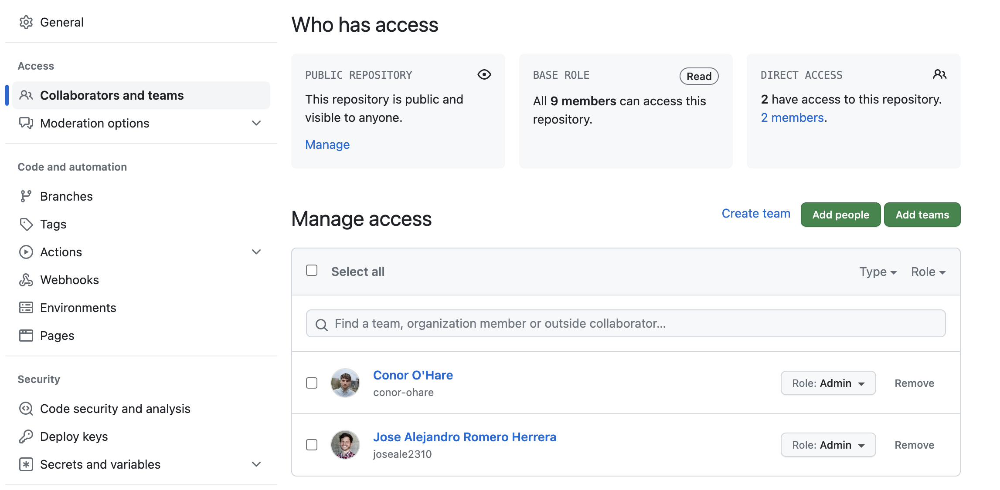

# course-template repo

This repository is the template for courses and webpages for self-learning used at the Danish Health Data Science Sandbox project.

## Start using this template

1. **Click the green `Use this template` button to the top right.**
  
 In the pop-up window:

   1. Choose an organisation where the repository will be hosted
   2. Enter a name for the new repository (keep in mind that this will be part of the URL)
   3. Decide if the repository should be Public (most likely) or Private
   4. Click **`Create repository from template`**

 

2. **Add collaborators**

 Go to settings and select `Collaborators and teams` under `Access` in the left side menu 

  1. Click one of the green buttons `add people`  or `add teams`
  2. Select a person or a team to invite
  3. Select the appropriate role 
  4. Click `add user to this repository`

 

3. **Update the README.md file**

 Modify and add information about the new workshop/course.

4. **Delete the .tmp folder**

 The `.tmp` folder just supports this README file, so you can delete it after modifying it.

# Structure

Everything necessary is in the main branch.

## Course material

There are already some examples folders for notebooks, scripts and so on, but you can create any extra folder you need. Notebooks, exercises and materials associated to them (like images) should be in those folders. 

Remember:

> **Maintaining only one version of the coding material is essential to ensure consistency and avoid confusion. Please do not make copies on the server or locally; use version control for edits instead.**

On the other hand, actual data and slides can be too big for a GitHub repository. Read the next section about hosting data in a [zenodo](https://zenodo.org/) repository. Consider what is the best strategy for hosting or sharing slides. For collaborative questions, there is a copy in SharePoint.

## Webpage

The folder `Webpage` containes an example template for the webpage which is done in `quarto`. You can use markdown and both jupyter notebooks and R markdown documents to create the content of the webpage. The file `_quarto.yml` contains the configuration of the webpage. other folders contains various needed resources like images, cards with instructors photos, bioschemas, etc. To see some examples of quarto configurations and bioschemas, look at our webpages from established courses, or the [quarto documentation](https://quarto.org/). R libraries to compile the R markdown files must be in the `renv.lock` file which you create locally when you develop your course material. [Here the docs to renv and how to create a snapshot of packages in renv.lock](https://rstudio.github.io/renv/articles/renv.html).

### Some suggestions

Some R packages are a gigantic PITA to install and need a lot of librares. An example: in the [Github Action File](.github/workflows/publish.yml) most of the linux libraries installed with `apt-get` are needed because otherwise it is impossible to install the `ragg` package. This was found out after hours of attempts to make the publication workflow to work. **If you can, stick to rendered jupyter notebooks which need no packages to be rendered into html format**. Your life will be muuuuuch easier, and github actions will always complete in few minutes.

### Hosting data in Zenodo

Zenodo is an Open Science data repository from the OpenAIRE project supported by [CERN](https://home.cern/) to ensure that everyone can join in Open Science. 
It allows researchers to upload many different types of data and gives each repository a unique and citeable identifier (DOI). 
We can also link a GitHub repository and whenever you create a release for the GitHub repo, it will give it as well a DOI. 
Follow this [link](https://docs.github.com/en/repositories/archiving-a-github-repository/referencing-and-citing-content) for instructions 
We are using Zenodo to deposit complementary materials and data necessary for the course, relieving the size of the GitHub repo. It also makes it easier to update the materials and use them in the UCloud apps and in any other computing cluster/local computer.

### Github actions

The tool we use to create the website is Quarto with the theme [`material`](https://squidfunk.github.io/). Instead of relying on Quarto, we use GitHub Actions to automatically build and deploy the website. Every time you push a change to the `main` branch, the webpage will be automatically recreated with any new changes. This is done using a GitHub Action workflow that runs on every push to the `main` branch which includes changes in the `Webpage` folder (so you avoid recompiling the webpage when doing unrelated changes). The workflow is defined in the [Github Action File](.github/workflows/publish.yml). 

The action will create a new branch called `gh-pages`. This will contain the rendered page and **MUST NEVER EVER BE MODIFIED**. If you do it by mistake, it is actually fine. simply delete the branch and push changes to the `Webpage` folder again.

## Docker

We will avoid creating docker containers for every course, otherwise they will easily be outdated and too many to control. There is instead a global docker container for each app which can be used on any cluster through the correct instructions, if either docker or singularity is installed (otherwise the user will be on its own to create a software environment). To see the instructions for the container app, go to the [Intro to GWAS](https://hds-sandbox.github.io/GWAS_course/) or [Intro to NGS data analysis](https://hds-sandbox.github.io/Intro-NGS-AU_course/) access instructions, where you can see how two different courses run from the same app in different user scenarios.

If you do not have you course onto an app, it is still easier to either

- make your own configuration for ucloud, or
- use a software environment in genomeDK, uCloud or any other cluster or local PC

until you have your course as part of a Sandbox App. 